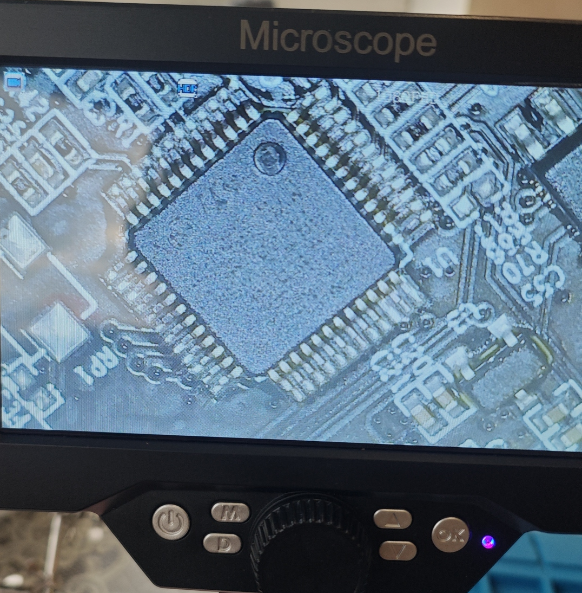
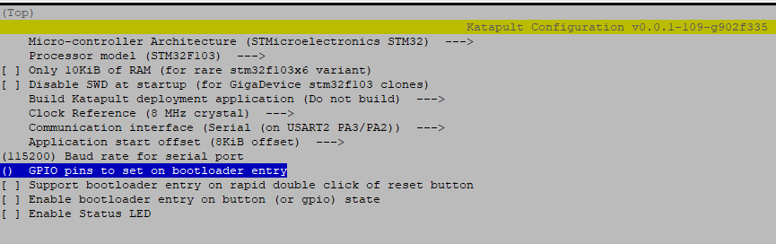
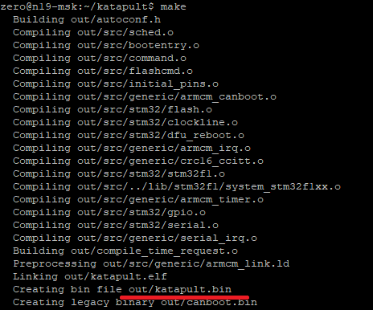
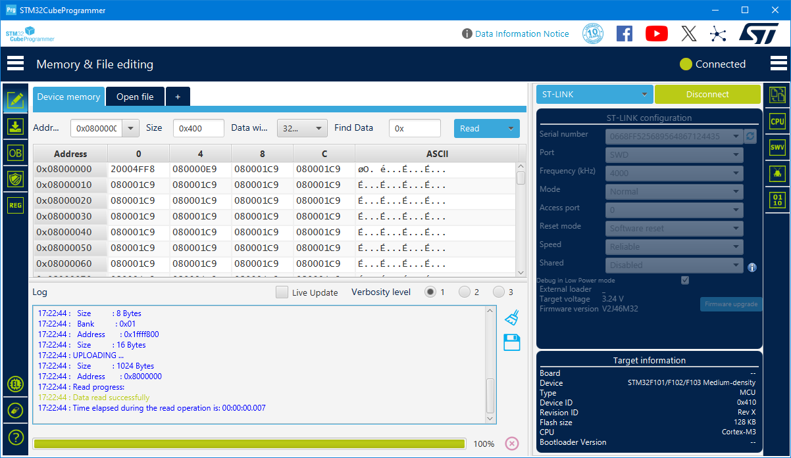
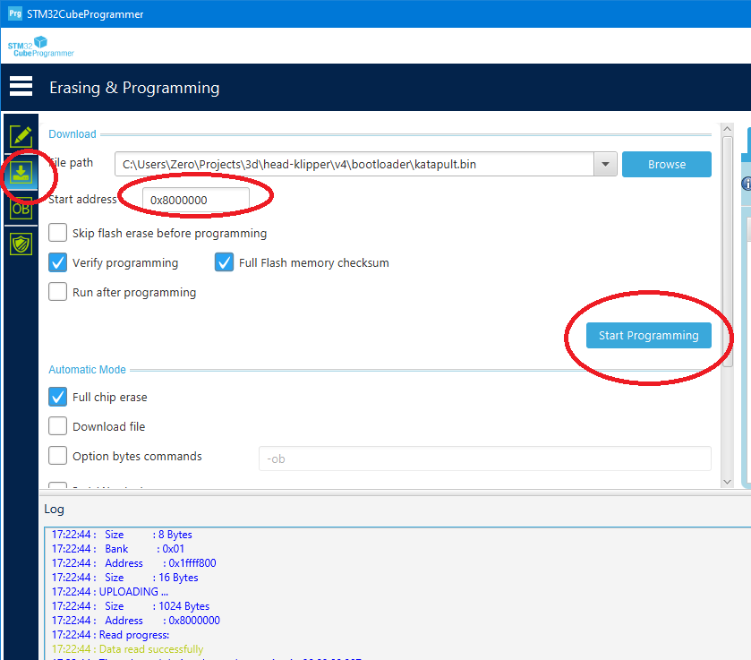
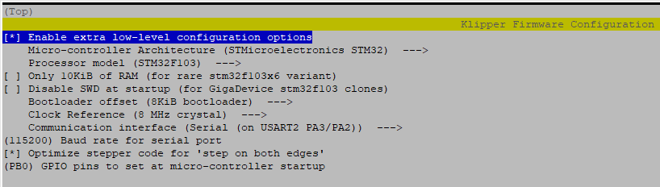
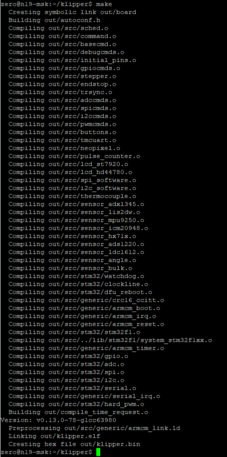
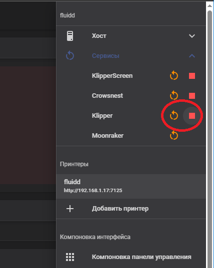
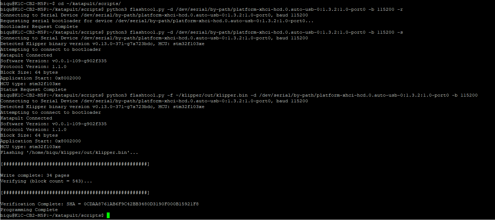
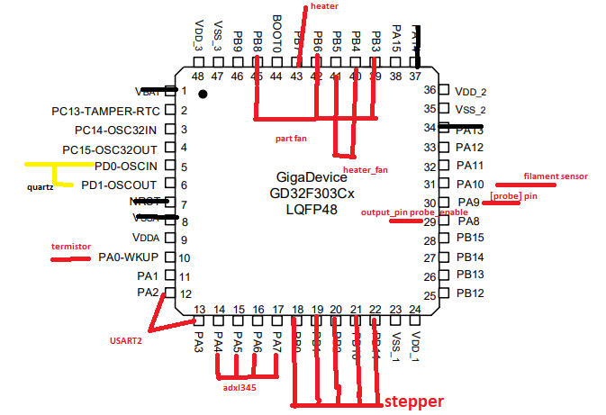

# K1_T9_GD32F303CBT6  

Проект по замене чипа `GD32F303CBT6` на `STM32F103CBT6`  
Цель проекта: После замены матери на Manta M5P, хотелось упавлять прошивкой головы, купил ebb42 на замену, но переделывать выходы внтиляторов, делать новый адаптер было накладно, решил попробовать поменять MK на STM32 у родной платы, данный MK проверен временем, стабильная кодовая база и т.д.  

**BOM:**
* `STM32F103CBT6`x1 можно заказать на aliexpress за копейки ну или на ozon задорого  
* `STLink V2.1 USB-модуль для отладки STM32` https://aliexpress.ru/item/1005005303809188.html  
* Software `STM32CubeProgrammer` https://www.st.com/en/development-tools/stm32cubeprog.html  
* Прямые руки для замены чипа(нужен фен, паяльник, флюс,отмывка, мкроскоп, мильтиметр, если не знаешь что это такое, то лучше обраться к тем кто умеет), или обратиться в мастерскую по починке техники, думаю вам там все сделают  
* коннектор JST-XH2.54 4p для удобного подключения к STLink V2.1  (выпаивать его не надо)  


## Замена чипа
Выпаиваем старый чип, отмываем плату  
  

Устанавливаем новый чип, отмываем плату, проверям контакты мультиметром  

  
  

## Прошивка чипа
Для того что бы обновлять чип не черз контакты отладки, а програмно, нужно залить bootloader, я использовал [katapult](https://github.com/Arksine/katapult)  

### Сброка bootloader

```bash
git clone https://github.com/Arksine/katapult
cd katapult
make menuconfig
```
Micro-controller Architecture (STMicroelectronics STM32)  
Processor model (STM32F103)  
Build Katapult deployment application (Do not build)  
Clock Reference (8 MHz crystal)  (У нас на плате стоит внешний кварц на 8MHz)
Communication interface (Serial (on USART2 PA3/PA2))
(115200) Baud rate for serial port
  

Собираем bootloader
```bash
make
```
  
просре сборки скачиваем прошивку `katapult.bin` на машину с виндой

### Прошивка bootloader
подключаем плату через разъем отладки к компу, и заливаем на неё наш `katapult.bin`

  

  

загружаем bootloader  


Все, теперь загружать прошивку klipper

### Прошивка klipper

```bash
cd ~/klipper/
make menuconfig
```
выбираем все как на скрине  

(PB0) GPIO pins to set at micro-controller startup - ставим высокий уровень, этот пин отвечает за направление вращения двигателя экструдера  

```bash
make
```


### Загрузка прошивки klipper
Подключаем нашу плату к принтеру, у меня стоит Manta M5P  
перед загрузкой прошивки надо остановить сервис клипера  

```bash
cd ~/katapult/scripts/
#переводим в режим бутлодера
python3 flashtool.py -d /dev/serial/by-path/platform-xhci-hcd.0.auto-usb-0:1.3.2:1.0-port0 -b 115200 -r
#проверяем статус
python3 flashtool.py -d /dev/serial/by-path/platform-xhci-hcd.0.auto-usb-0:1.3.2:1.0-port0 -b 115200 -s
#загружаем прошивку
python3 flashtool.py -f ~/klipper/out/klipper.bin -d /dev/serial/by-path/platform-xhci-hcd.0.auto-usb-0:1.3.2:1.0-port0 -b 115200 
```


### Изменения в printer.cfg
нужно поменять baud на `115200`
```
[mcu nozzle_mcu]
serial: /dev/serial/by-path/platform-xhci-hcd.0.auto-usb-0:1.3.2:1.0-port0
baud: 115200
restart_method: command
```


### Дополнительная информация
[STM32F103xx_Datasheet.pdf](datasheets/STM32F103xx_Datasheet.pdf)  
[GD32F303xx_Datasheet_Rev1.9.pdf](datasheets/GD32F303xx_Datasheet_Rev1.9.pdf)  

Пины
```
nozzle_mcu:
PB0  - [extruder] dir_pin
PB1  - [extruder] step_pin
PB2  - [extruder] enable_pin
PB7  - [extruder] heater_pin
PA0  - [extruder] sensor_pin

PB11 - [tmc2209 extruder] uart_pin USART3
PB10 - [tmc2209 extruder] tx_pin   USART3 драйвер подключен по uart

PA10 - [filament_switch_sensor filament_sensor] switch_pin 

PA4  - [adxl345] cs_pin
PA5  - [adxl345] spi_software_sclk_pin
PA6  - [adxl345] spi_software_miso_pin
PA7  - [adxl345] spi_software_mosi_pin

PB8  - [fan_generic part] pin
PB6  - [fan_generic part] enable_pin
PB3  - [fan_generic part] tachometer_pin

PB5  - [heater_fan hotend]  pin
PB4  - [heater_fan hotend]  tachometer_pin

PA8  - [output_pin probe_enable] pin

PA9  - [probe] pin

PA2  - [USART2]
PA3  - [USART2]

[Разъем для отладки]
Vbat - 3.3в линия для питания
PA13 - SDIO 
PA14 - CLK
Vsaa - подтянут к земле идет в отлкдку
NRST - debug 

[подключение внешнего кварца на 8Mhz]
PD0-OSC_IN 
PD1-OSC_OUT
```



[.config](configs/.config) - конфиг для сборки прошивки klipper на всякий случай
